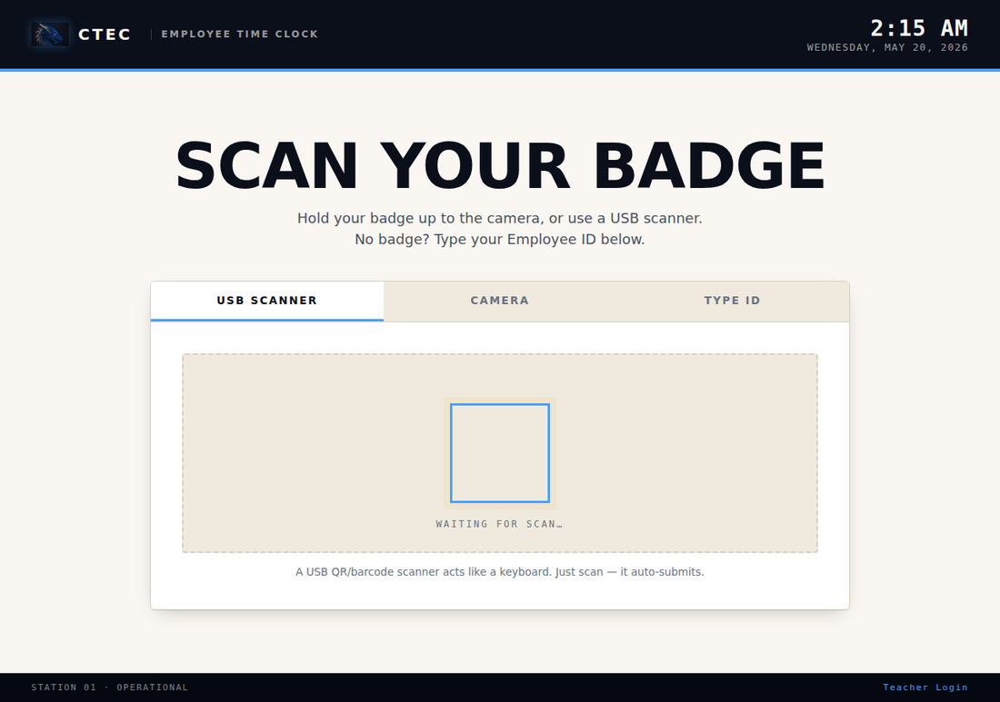
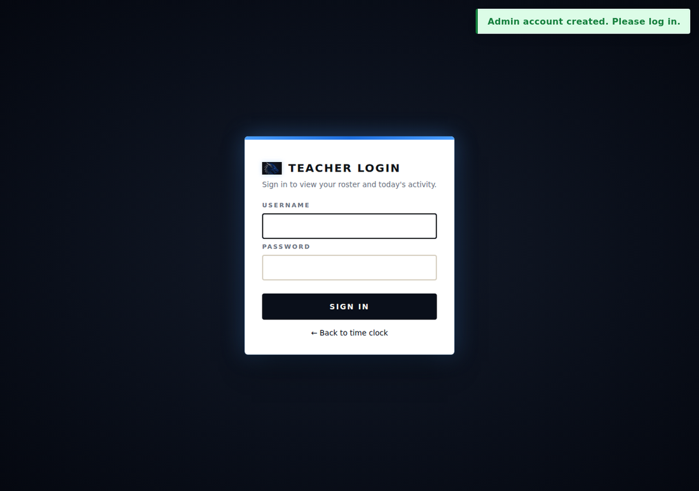
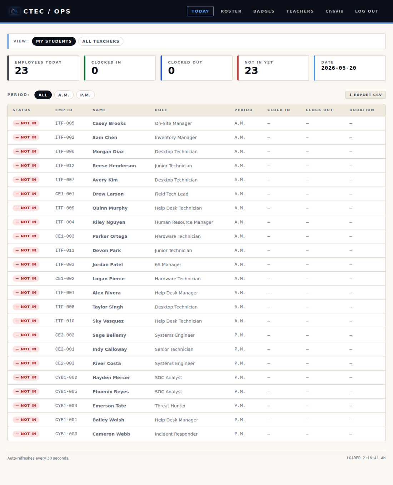
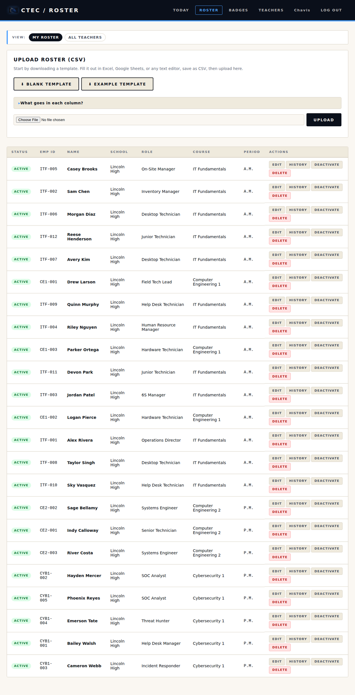
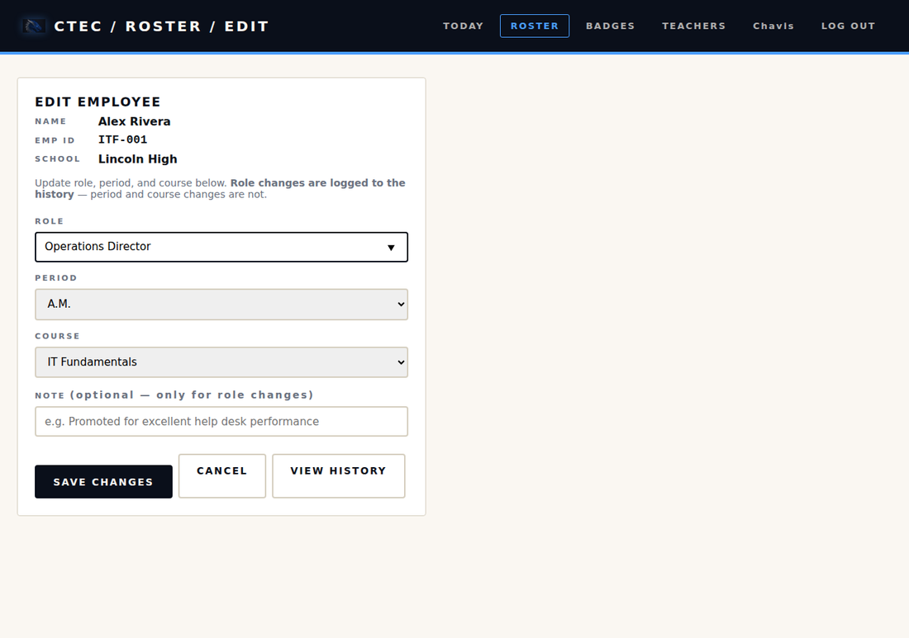
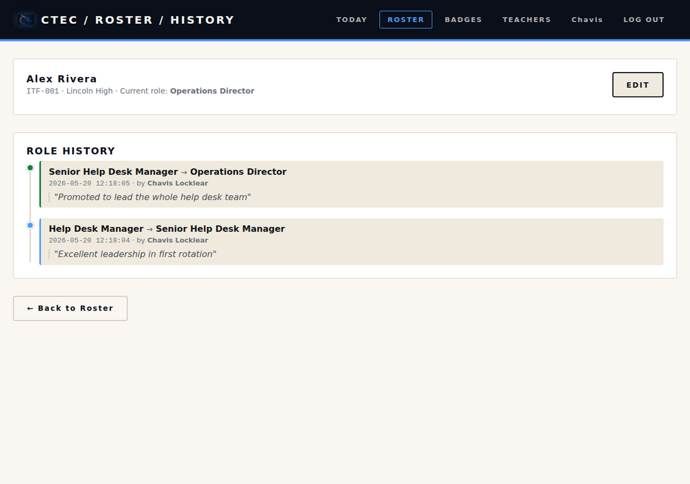

# CLOCKIN — CTEC Time Clock

A simulated-workplace QR-badge time clock for CTE classrooms.
Built by **Ciri** for an AI-powered classroom operations ecosystem.

Students scan a printed QR badge to clock in and out of class as if reporting to a workplace. Teachers see a live dashboard of who's "on shift" each period and can export attendance to CSV for entry into the school's official system.



---

## Table of contents

- [What it does](#what-it-does)
- [Install via Portainer (for teachers — easiest path)](#install-via-portainer-for-teachers--easiest-path)
- [Install manually (without Portainer)](#install-manually-without-portainer)
- [What's in the box](#whats-in-the-box)
- [Quick start (developer / source install)](#quick-start-developer--source-install)
- [How the multi-teacher model works](#how-the-multi-teacher-model-works)
- [First-run flow](#first-run-flow)
- [Daily workflow](#daily-workflow)
- [Hardware options for the kiosk](#hardware-options-for-the-kiosk)
- [Roster CSV format](#roster-csv-format)
- [Editing a student](#editing-a-student)
- [Deleting a student](#deleting-a-student)
- [Password resets](#password-resets)
- [Security notes](#security-notes)
- [Backup](#backup)
- [Docker reference commands](#docker-reference-commands)
- [What's intentionally NOT in this version](#whats-intentionally-not-in-this-version)
- [What's next](#whats-next)

---

## What it does

- Students scan a QR badge (or type their Employee ID) on a classroom computer to clock in. A second scan later in the period clocks them out.
- Each teacher signs in with a username and password to see their own roster, today's clock-ins/clock-outs, and shift durations.
- Periods are **A.M.** or **P.M.** (block schedule). Filter the dashboard by either.
- Generate a printable PDF of QR badges, 8 per US-letter page, sized for standard lanyard sleeves.
- Edit a student's role, period, or course any time. Role changes are logged to a per-student timeline with the date, who changed it, and an optional note ("Promoted for excellent help desk performance").
- Permanently delete a student with a type-to-confirm safety check, when they transfer out or you fix a data-entry mistake.
- Export today's attendance to CSV for entry into your school's official attendance system.

It does **not** replace your school's attendance system. It gives students ownership of their own clock-in routine and gives you a quick reference.

**The workplace simulation:** students at **CTEC** (the school) report to work at **Dragon Technologies** — a fictional company they "work for" during class. The kiosk and badges carry the Dragon Technologies logo, so badging in feels like reporting to a real employer. If you adopt this for your own classroom, the school name, company name, and logo are easy to swap — the names are plain text and the logo is one image file in `static/img/`.

---

## Install via Portainer (for teachers — easiest path)

If you have a school server, NAS, or home server with **Docker** and **Portainer** already running, you can have this app live in about 5 minutes. You don't need to write any code or install anything beyond Portainer.

If you don't have Portainer yet, your school's IT department or a tech-savvy colleague can set it up — it's a free web interface for managing Docker containers. Skip to "Install manually (without Portainer)" below if you'd rather use the command line.

### Step 1 — Open Portainer in your browser

Usually at `http://your-server-ip:9443` or `http://your-server-ip:9000`. Sign in.

### Step 2 — Create a new stack

Click **Stacks** in the left sidebar → click **+ Add stack**.

- **Name:** `clockin` (lowercase, no spaces — Portainer is strict about this)

### Step 3 — Pick the Repository build method

Under **Build method**, click **Repository**.

Fill in:

- **Authentication:** leave OFF (the repo is public)
- **Repository URL:** `https://github.com/Chavi7/clockin`
- **Repository reference:** `refs/heads/main`
- **Compose path:** `compose.yml`

Leave "Automatic updates" off for now.

### Step 4 — Add the secret

Scroll down to **Environment variables** → click **+ Add an environment variable**.

- **name:** `CLOCKIN_SECRET`
- **value:** any long random string

To generate one, run this on the server:
```bash
python3 -c "import secrets; print(secrets.token_hex(32))"
```

Copy the 64-character output and paste it as the value.

### Step 5 — Deploy

Scroll to the bottom and click **Deploy the stack**.

Portainer will clone the repo, build the Docker image (2-5 minutes the first time), and start the container.

### Step 6 — Open the kiosk

Once deployment finishes, open:
```
http://your-server-ip:5000/
```

You should see the **SCAN YOUR BADGE** kiosk page.

Then go to `http://your-server-ip:5000/login` — you'll be redirected to `/setup` because the database is fresh. Create your admin account and you're live.

### Updating later

When changes are made to the code on GitHub, come back to Portainer:

**Stacks → clockin → Pull and redeploy → confirm**

That's it. The container rebuilds with the latest code, and your database survives because it's stored in a Docker volume.

---

## Install manually (without Portainer)

If you'd rather use the command line and you have Docker installed:

```bash
git clone https://github.com/Chavi7/clockin.git
cd clockin
echo "CLOCKIN_SECRET=$(python3 -c 'import secrets; print(secrets.token_hex(32))')" > .env
docker compose up -d --build
```

Then open `http://localhost:5000/`.

To stop: `docker compose down`. To update later: `git pull && docker compose up -d --build`.

---

## What's in the box

```
clockin/
├── app.py                          # Flask app — all routes and logic
├── requirements.txt                # Python deps: Flask, qrcode, reportlab, bcrypt, gunicorn
├── sample_roster.csv               # 23 example students across 4 courses
├── README.md                       # this file
├── LICENSE                         # MIT
├── Dockerfile                      # builds the production container image
├── compose.yml                     # Docker Compose service definition
├── .dockerignore                   # files Docker excludes from the image
├── .env.example                    # template for environment variables
├── .gitignore
├── scripts/
│   └── schema.sql                  # teachers + employees + shifts + role_history
├── templates/
│   ├── base.html
│   ├── _nav.html                   # shared nav bar partial
│   ├── kiosk.html                  # public time clock (no login)
│   ├── setup.html                  # first-run admin account creation
│   ├── login.html
│   ├── profile.html                # change own password, email, courses
│   ├── dashboard.html              # today's clock-ins + period filter
│   ├── roster.html                 # student list + CSV upload + edit/history/delete
│   ├── employee_edit.html          # edit role / period / course
│   ├── employee_history.html       # role-change timeline
│   ├── employee_delete.html        # confirm-to-delete page
│   ├── badges.html                 # print badge PDFs
│   ├── teachers.html               # admin: list of teacher accounts
│   ├── teacher_form.html           # admin: add new teacher
│   └── error.html
├── static/
│   ├── css/styles.css
│   ├── img/                        # Dragon Technologies logo (kiosk, badges, login)
│   └── js/
│       ├── jsQR.js                 # QR-decoding library (self-hosted, no CDN)
│       └── kiosk.js                # scanner + camera + manual input controller
├── docs/                           # screenshots used in this README
└── data/                           # SQLite database lives here (auto-created)
```

---

## Quick start (developer / source install)

This path is for poking at the code or making changes. If you just want to install and use the app, see **Install via Portainer** above.

### Requirements
- Python 3.10 or newer
- Linux / macOS / Windows

### Install

```bash
git clone https://github.com/Chavi7/clockin.git
cd clockin
python3 -m venv .venv
source .venv/bin/activate            # Windows: .venv\Scripts\Activate.ps1
pip install -r requirements.txt
```

### Configure

Set a long random secret for session signing:

```bash
export CLOCKIN_SECRET="$(python3 -c 'import secrets; print(secrets.token_hex(32))')"
```

On Linux, put this in `~/.bashrc` or in your systemd unit's `Environment=` lines. On Windows PowerShell:

```powershell
$env:CLOCKIN_SECRET = -join ((48..57) + (65..90) + (97..122) | Get-Random -Count 64 | ForEach-Object {[char]$_})
```

A `.env.example` is included as a template — copy it to `.env` and fill it in if you'd rather use a file.

### Run

```bash
python app.py
```

Output:
```
 * Running on http://0.0.0.0:5000
```

From any classroom computer on the same network, open `http://your-server-ip:5000/`. The kiosk page is public — no login needed.

---

## How the multi-teacher model works

**Login identifier: username, not email.** Each teacher picks a username (3-32 characters; letters, digits, dots, underscores, hyphens). Usernames are case-insensitive — `Chavis` and `chavis` are the same account. Email is optional and used only for future password reset features.

**Roles:**
- **Admin** — full access. Sees every teacher's roster and today's activity. Creates teacher accounts. Promotes/demotes other teachers. Resets passwords. Reassigns student ownership. Can delete any student.
- **Teacher** — sees only their own roster. Uploads their own CSV. Prints their own badges. Edits, deactivates, or deletes their own students.

**Student ownership:**
- Every student belongs to exactly one teacher (the one who uploaded them).
- If a second teacher uploads a CSV containing a student already owned by someone else, that row is **skipped** with a warning. No silent overwrites.
- Admins can reassign ownership manually from the Roster page in "ALL TEACHERS" view.

**The kiosk is shared:**
- One public time clock URL for the whole school. Any student from any teacher's roster can clock in from it.
- The dashboard each teacher sees is filtered to their own students. Admins can toggle "MY STUDENTS / ALL TEACHERS".

**Account creation:**
- Admin-only. No self-signup. You (the first admin) create accounts for other teachers and hand them an initial password in person.
- Teachers are required to change the initial password on first login.

---

## First-run flow

1. From any computer, open `http://your-server-ip:5000/login`.
2. The system detects there are no accounts and redirects you to **/setup**.
3. Enter your full name, a username, an optional email, your courses (also optional), and a password (at least 8 characters). This becomes the first admin account.
4. Log in with your username and password.
5. Click **ROSTER** and upload your CSV. Use the **BLANK TEMPLATE** or **EXAMPLE TEMPLATE** button to download a starter file.
6. Click **BADGES** to print a PDF of QR badges for the students you just uploaded.
7. To add another teacher: **TEACHERS → + ADD TEACHER**. Give them their username and initial password in person. They'll be forced to change it on first login.



---

## Daily workflow

### For students (the kiosk)
- The kiosk is always public at `http://your-server-ip:5000/`. No login.
- Scan badge → green **CLOCKED IN** screen with name, role, and period.
- Scan again at end of period → blue **CLOCKED OUT** screen with shift duration.

### For teachers
- Sign in at `/login`.
- The **TODAY** page shows your students who clocked in, who clocked out, and who isn't here yet, organized by period.
- Filter by **A.M.** or **P.M.** with the period chips.
- Click **EXPORT CSV** to get a file for entering into your school's official attendance system.



### For admins
- All of the above, plus:
- On the dashboard and roster, toggle **VIEW: MY STUDENTS / ALL TEACHERS** to see other teachers' data.
- Manage teacher accounts from the **TEACHERS** page (create, promote, reset password, deactivate).

The roster page lists every student with buttons to edit, view history, deactivate, or delete:



---

## Hardware options for the kiosk

The kiosk supports three input modes:

| Mode | Cost | Pros | Cons |
|------|------|------|------|
| **USB scanner** | $15–25 | Fastest. Auto-submits. Most "workplace" feel. | Need to buy one. |
| **Webcam** | $0 (built-in) | Works on any classroom PC. | Slower; lighting matters; requires HTTPS for non-localhost. |
| **Type ID** | $0 | Fallback when nothing else works. | Easy to fake; only as a backup. |

Default is USB scanner. The kiosk auto-resets 5 seconds after each scan.

**Note on webcam mode:** browsers only allow camera access on `http://localhost` or HTTPS. If you'll be accessing the kiosk from other classroom computers over the LAN, the USB scanner and Type ID modes work over plain HTTP, but the in-browser camera does not.

The **BADGES** page generates a print-ready PDF — 8 badges per US-letter page, each with a QR code, the student's name, role, and Employee ID:


---

## Roster CSV format

**The fastest way:** go to the **ROSTER** page and click **EXAMPLE TEMPLATE**. You'll get a CSV with realistic sample rows. Edit it in Excel or Google Sheets, save as CSV, upload.

If you want to start from scratch, click **BLANK TEMPLATE** instead — just the headers.

### Columns

| Column | Required? | What it is |
|---|---|---|
| `employee_id` | Optional | Leave blank to auto-generate. Fill in only if you want a specific ID. |
| `first_name` | Required | Appears on the badge. |
| `last_name` | Required | Appears on the badge. |
| `school` | Required | Appears on the badge header. |
| `student_id` | Optional | Your school's official student ID number. |
| `role` | Optional | Workplace role (Help Desk Manager, Desktop Technician, SOC Analyst, etc.). Appears on the badge. |
| `course` | Recommended | Which class. Used for the auto-generated Employee ID prefix. |
| `period` | Optional | Must be `A.M.` or `P.M.`. Variants like `am`, `morning`, `afternoon`, `1`, `2` get normalized automatically. |

### Auto-generated Employee IDs

Leave the `employee_id` column blank and the system fills it in based on the course:

| Course | Generated prefix |
|---|---|
| IT Fundamentals | `ITF-001`, `ITF-002`, `ITF-003`... |
| Cybersecurity 1 | `CYB1-001`, `CYB1-002`... |
| Cybersecurity 2 | `CYB2-001`, `CYB2-002`... |
| Computer Engineering 1 | `CE1-001`, `CE1-002`... |
| Computer Engineering 2 | `CE2-001`, `CE2-002`... |
| (anything else / blank) | `STU-001`, `STU-002`... |

Numbering continues from the highest existing ID, so re-uploading new students later won't collide.

If you want a specific ID (e.g. matching a school-issued number), just type it in the `employee_id` column and it'll be used as-is.

### Teacher courses

When you create the first admin account (and when admins create new teachers), there's an optional **COURSES YOU TEACH** field. Type the courses informally — `Cyber 1, CompE 2, IT Fund` — and the system normalizes them behind the scenes to canonical names (`Cybersecurity 1, Computer Engineering 2, IT Fundamentals`).

You can update your own courses any time from the **PROFILE** page.

Recognized variants for each course:
- **IT Fundamentals** — `IT Fund`, `ITF`, `Fundamentals`
- **Cybersecurity 1** — `Cyber 1`, `Cyber I`, `CYB1`, `Cybersecurity I`
- **Cybersecurity 2** — `Cyber 2`, `Cyber II`, `CYB2`
- **Computer Engineering 1** — `Comp Eng 1`, `CompE 1`, `CE1`
- **Computer Engineering 2** — `Comp Eng 2`, `CompE 2`, `CE2`

Anything else gets stored as you typed it.

---

## Editing a student

On the Roster page, click **EDIT** next to any student to open the edit form. You can change:

- **Role** — free text with autocomplete suggestions for common workplace roles
- **Period** — A.M. / P.M. / Unassigned
- **Course** — pick from your 5 courses or keep an existing custom value
- **Note** — optional reason for the change (only saved when the role changes)



**Role changes are logged to a per-student history**, viewable by clicking **HISTORY** next to the row. Period and course changes are applied silently — they're routine administrative details that don't deserve a history record.

The history page shows a timeline of every role change with the date, the teacher who made it, and the note. Useful for tracking "promotions" in the workplace simulation.



---

## Deleting a student

Two ways to remove a student from your roster:

**Deactivate** (the safe option) hides them from all views but keeps the database row, shift records, and role history. Use this for students who transfer out, students who shouldn't appear right now, or anyone you might need attendance records for later.

**Permanently Delete** (the irreversible option) wipes the employee row, every shift they ever logged, and their entire role history. Use this for data-entry mistakes or rare cleanup. The confirmation page shows exactly what'll be deleted and requires you to type the student's Employee ID exactly to confirm.

Owners (the teacher who uploaded the student) and admins can delete. Other teachers cannot touch students that aren't theirs.

---

## Password resets

There's no email server yet. When a teacher forgets their password:

1. As admin, go to **TEACHERS**.
2. Click **RESET PASSWORD** next to their name.
3. A temporary password is shown in a flash message at the top of the screen.
4. **Copy it and give it to them in person** — it won't be shown again.
5. They log in with that temporary password and are forced to change it immediately.

Later, when we add email infrastructure, this will become a self-service "forgot password" link.

---

## Security notes

What's secure:
- Passwords stored as bcrypt hashes (not plaintext, not reversible)
- Session cookies signed with `CLOCKIN_SECRET` — can't be forged without the secret
- Role-based access enforced on every protected route (not just hidden in the UI)
- Type-to-confirm safety check on permanent delete
- One-admin-minimum guard prevents accidentally locking out all admins

What's intentionally simple:
- No HTTPS by default. Fine for a firewalled classroom LAN. Add a reverse proxy (Caddy, nginx) with Let's Encrypt if you ever expose this to the public internet.
- No CSRF tokens on POST forms. Acceptable for a single-LAN tool; add Flask-WTF if you expose beyond your school's network.
- No rate limiting on login. Use strong passwords.
- Sessions live 12 hours. Adjust `PERMANENT_SESSION_LIFETIME` in `app.py` to change.

---

## Backup

The database is a single file: `data/clockin.db`. To back up:

```bash
cp data/clockin.db data/clockin-backup-$(date +%Y%m%d).db
```

Set up a daily cron job to do this automatically. The file is small (under 1 MB even with a year of data) so it's cheap to keep many copies.

On Windows PowerShell:
```powershell
Copy-Item data\clockin.db "data\clockin-backup-$(Get-Date -Format yyyyMMdd).db"
```

If you're running in Docker, the database is in a named volume (`clockin-data`). Back it up like this:

```bash
docker run --rm -v clockin-data:/data -v "$PWD":/backup alpine \
  tar czf /backup/clockin-backup-$(date +%Y%m%d).tar.gz -C /data .
```

To restore:

```bash
docker run --rm -v clockin-data:/data -v "$PWD":/backup alpine \
  tar xzf /backup/clockin-backup-YYYYMMDD.tar.gz -C /data
```

---

## Docker reference commands

The project ships with a `Dockerfile`, `compose.yml`, and `.dockerignore`. The Portainer install above is the easiest way for most people, but if you're running Docker directly from a terminal, these are the commands worth knowing:

```bash
# Build and start
docker compose up -d --build

# Watch the logs
docker compose logs -f

# Stop (data preserved in the named volume)
docker compose down

# Stop AND wipe the database (irreversible)
docker compose down -v

# Pull latest code and rebuild
git pull && docker compose up -d --build
```

The container runs Gunicorn (production WSGI server) with 2 workers, exposes port 5000, restarts automatically on failure, and reports health to Docker every 30 seconds. The SQLite database lives in a Docker named volume called `clockin-data`, so rebuilding the image doesn't lose data.

To change the host port (e.g. run on 8080 instead of 5000), edit `.env`:

```
CLOCKIN_PORT=8080
```

Then `docker compose up -d` to apply.

---

## What's intentionally NOT in this version

- No tickets, no inventory, no AI agents. Those are upcoming modules.
- No buddy-punching prevention. If students scan each other's badges, the log will show it — but the system trusts the scan.
- No mobile app. The web kiosk works on any browser, including phones.
- No email notifications. Email is collected only for future password reset.

These are deliberate cuts to keep the MVP small enough to validate in real classroom use before layering on more.

---

## What's next

This is **Module 1** of a larger system. Upcoming modules will hang off the same database:

- **Ticket Management Agent** — students submit and resolve troubleshooting tickets like real help desk technicians
- **Inventory Manager AI** — asset tracking, check-out/check-in of hardware
- **Lab Dispatch Agent** — assign individualized labs and work orders
- **AI Tutor Agent** — Socratic guidance for certification prep
- **Incident Response Agent** — generate cybersecurity scenarios for SOC simulation

The `employees` table is the foreign key everything else will hang off of, so today's data carries forward without migration when those modules arrive.

— Ciri
